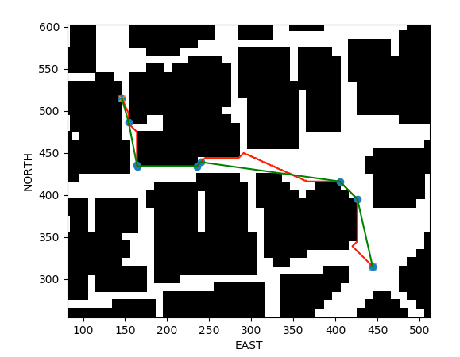

## Project: 3D Motion Planning

---

# Required Steps for a Passing Submission:
1. Load the 2.5D map in the colliders.csv file describing the environment.
2. Discretize the environment into a grid or graph representation.
3. Define the start and goal locations.
4. Perform a search using A* or other search algorithm.
5. Use a collinearity test or ray tracing method (like Bresenham) to remove unnecessary waypoints.
6. Return waypoints in local ECEF coordinates (format for `self.all_waypoints` is [N, E, altitude, heading], where the drone’s start location corresponds to [0, 0, 0, 0].
7. Write it up.
8. Congratulations!  Your Done!

## [Rubric](https://review.udacity.com/#!/rubrics/1534/view) Points
### Here I will consider the rubric points individually and describe how I addressed each point in my implementation.  

---
### Writeup / README

#### 1. Provide a Writeup / README that includes all the rubric points and how you addressed each one.  You can submit your writeup as markdown or pdf.  

You're reading it! Below I describe how I addressed each rubric point and where in my code each point is handled.

### Explain the Starter Code

#### 1. Explain the functionality of what's provided in
     `motion_planning.py` and `planning_utils.py`
	 
	 First, let us compare the functionality of motion_planning.py
     relative to that of backyard_flyer.py, as requested in the
     rubric. It is observed that a new state termed PLANNING is
     introduced. This state takes place after ARMING and before
     TAKEOFF. In the state PLANNING, the function plan_path() is
     executed. This function loads the 2.5D map, creates a 2D grid on
     it, and applies A* to find a plan that goes from the current
     position of the drone to an aribitrarily picked location.  A
     function is also added to visualize the waypoints in the
     simulator.
	 
	 Second, let us outline the functionality of planning_utils.py.
	 The following methods are provided:
	 
	 - def create_grid(data, drone_altitude, safety_distance). This
       function creates a 2D grid using the 2.5D map in <data>. The grid
       resolution is one length unit, in the case of colliders.csv it
       is 1 m. 
	   
	 - def valid_actions(grid, current_node). This method determines
       whether a candidate action (so movement to another grid point)
       gets off the grid or coincides with the location of an
       obstacle. 
	   
	 - def a_star(grid, h, start, goal) implements the algorithm A*
       for finding paths with lowest cost. A heuristic function is
       used to speed up this search. 
	   
	 - def heuristic(position, goal_position) is a heuristic function
       to be used in combination with a_star(). This function returns
       the Euclidean distance between two spatial points. 
	 
	 	 
	 
------------------------- 	 

### Implementing Your Path Planning Algorithm

#### 1. Set your global home position

Just wrote code to read the first line of colliders.csv, parsed it,
and invoked set_home_position().

#### 2. Set your current local position

The GPS position is determined by reading the property of
drone.global_position. Using global_to_local(), this position is
converted to the NED frame located at the position that the first line
of colliders.csv indicates.

We observe that the simulator initializes the drone to be precisely at
approximately the origin of the aforementioned NED frame.

#### 3. Set grid start position from local position

For readability, I wrote two functions in planning_utils.py with name
grid_to_ned and ned_to_grid. Setting the starting position relative to
the grid becomes immediate. 

#### 4. Set grid goal position from geodetic coords

I did it using global_to_local() as well as ned_to_grid().

I also introduced a line to specify the coordinates in NED, which is
more convenient for me when doing tests.

Furthermore, I created a function  grid_to_on_grid() in
planning_utils.py that provides the closest grid point to the
specified location. Then the destination will always be on the grid
and not e.g. inside an obstacle.

#### 5. Modify A* to include diagonal motion (or replace A* altogether)

I introduced the following modifications:

- I introduced four more tuples in Action corresponding to the
  diagonal movements. Their cost is approximately sqrt(2).
  
- I generalized valid_actions to check whether a candidate movement
  results in a point off the grid or on an obstacle. The checks for
  each candidate movement were hard coded in the original code. 

#### 6. Cull waypoints 

I wrote a function line_crashes() in planning_utils.py that uses
Bresenham's method to determine whether the line joining two spatial
points intersect with an obstacle. 

I then wrote an algorithm inside function planning_utils.prune() that
adds a point in the path to the list of waypoints only if the line
going from the previous waypoint to the following candidate point
intersects an obstacle. This reduces the number of waypoints much more
than colinearity tests since the condition for merging waypoints is
weaker in the way I implemented. 

### Execute the flight
#### 1. Does it work?

It works in all scenarios I tested.

